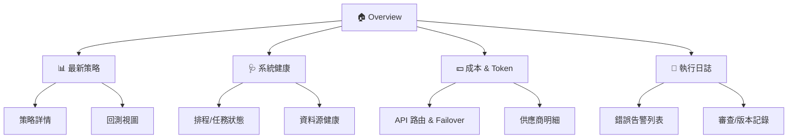

# 📐 Dashboard IA — Streamlit 資訊架構（不含程式碼）

> 目的：規劃行動優先（Mobile-first）的投資系統儀表板版面與資訊層級，對應 M1/M2/M3 階段逐步上線。
> 範圍：頁面結構、內容模組、資料來源、互動與狀態、告警/KPI、權限與可用性指引。

---

## 1) 導覽結構（Navigation Map）



- **MVP (M1)**：先上「🏠 Overview、📊 最新策略、🩺 系統健康、📜 執行日誌」。
- **M2**：補「💵 成本 & Token、API 路由 & Failover 視圖、策略詳情」。
- **M3**：完善「回測視圖、審查/版本記錄」。

---

## 2) 頁面與模組（Pages & Modules）

### 2.1 🏠 Overview
- **Top Bar 指標**：當日日期（NY/Local）、系統狀態燈、最近一次完成時間、資料延遲(sec)。
- **核心卡片**：
  - 最新策略（Rec/Size/Conf、更新時間、連結到策略詳情）
  - 市場快照（SPY 價格、日漲跌、VIX）
  - 健康燈號（Cron 準點率、Failover 成功率、LLM/API P50）
  - 成本摘要（今日 Token/成本、月累計 vs 目標 $2）
- **行動版**：卡片單欄；桌機版兩欄布局。

### 2.2 📊 最新策略（Strategies）
- **表格/卡片**：日期、標的、Rec（BUY/SELL/HOLD）、Position Size、Confidence、Sharpe(7/30)、MaxDD。
- **篩選**：日期區間、標的、最小信心、策略版本。
- **互動**：點擊列 → 策略詳情；導出 CSV/Markdown 報告。

### 2.3 策略詳情（Strategy Detail）
- **內容**：
  - 文本：Recommendation、Reasoning、Position Size、Confidence、生成時間、版本。
  - 圖表：價格 + RSI/MACD 疊圖、情緒分數時間序列、信心雷達。
  - 來源：引用的新聞連結（去重）、技術訊號快照。
- **側欄**：APIRouter 決策路徑（用哪個供應商/降級與否）、成本明細。
  - 版本：`strategies.version`
  - 追蹤：顯示 `run_id` / `trace_id`（點擊可連到「執行日誌」過濾檢視）
  - 來源：APIRouter 決策路徑（`vendor`, `fallback_used`, `latency_ms`, `tokens`, `cost_usd`）

### 2.4 🩺 系統健康（Health）
- **指標**：服務心跳、/health 檢查、Cron 成功率、Systemd 啟動狀態、備份成功率。
- **清單**：最新 10 次任務（開始/結束、耗時、結果、重試次數）。
- **圖表**：24h 任務耗時分佈、失敗率。

### 2.5 📜 執行日誌（Run Logs）
- **表格**：時間、Agent、等級、訊息、meta（trace id）。
- **搜尋**：關鍵字、Agent、等級（INFO/WARN/ERROR）。
- **導出**：CSV/JSON。

### 2.6 💵 成本 & Token（Costs）
- **總覽**：當日/當月成本與 Token；占比（Groq/Gemini/Claude）。
- **APIRouter 視圖**：各任務類型的供應商選擇率、Failover 次數/率。
- **趨勢**：7/30 日成本趨勢與門檻告警。

### 2.7 回測視圖（Backtest）
- **輸入**：日期區間、策略版本、標的群。
- **輸出**：P&L、Sharpe、MaxDD、Win Rate、Equity Curve、每筆交易列表（若有）。
- **對比**：與 Buy&Hold/基準指數比較。

### 2.8 審查/版本記錄（Audit & Changelog）
- **內容**：策略生成版本、Prompt 記錄摘要、重要變更（來自 docs/CHANGELOG.md）。
- **追蹤**：Milestone 完成狀態、核對 `progress.md` 勾選。

---

## 3) 資料來源與 Schema 映射（Data Mapping）

| 模組 | 來源表/檔 | 主要欄位 | 更新頻率 |
|---|---|---|---|
| 最新策略 | `strategies` | date, symbol, recommendation, position_size, confidence, reasoning | 每日 |
| 市場快照 | `prices` | close, change%, volume | 4h |
| 技術訊號 | `tech_signals` | rsi, macd, trend | 每日 |
| 情緒序列 | `sentiments` | score, summary | 每日 |
| 成本 | `logs/api_usage_summary.csv` | vendor, tokens, cost, task_type | 每日 |
| 健康 | `logs/`、`/health` | status, last_run_ts, success_rate | 每小時 |
| 回測 | `reports/backtest_report.md` or DB | sharpe, maxdd, pnl_series | 手動/批次 |
| 策略績效 | `strategy_metrics` | sharpe_7d, sharpe_30d, maxdd_30d, win_rate_30d | 每日 |

---

## 4) 狀態與互動（State & Interactions）

- **全域狀態**：日期區間、標的清單、時區（顯示 NY/Local）、更新時間戳。
- **快取策略**：首頁快照 5 分鐘；明細頁 1 分鐘；手動「重整」按鈕。
- **空/錯誤狀態**：
  - 無資料 → 顯示近 7/30 日缺口及「上次成功時間」。 
  - API/資料庫錯誤 → 顯示告警條，附上 trace id 與建議動作。
- **下載/匯出**：CSV、Markdown 報告、PNG 圖表截圖。

---

## 5) 告警與 KPI（運維可見性）

- **KPI 小卡**：
  - 可用性 ≥ 99%、Cron 準點率 ≥ 99%、Failover 成功率 ≥ 95%
  - 今日/本月成本 vs 目標 $2：條形圖或儀表
  - 任務 LLM/LLM/API P50 < 3s、管線 < 5m
- **告警條件**：
  - `/health` 失敗、備份失敗、Token 異常飆升、成本>門檻、策略信心<0.5、來源延遲>閾值。
- **通知**：Telegram/Email；訊息格式 `[TS][Module][SEV][code][hint]`。

---

## 6) 權限、可用性與無障礙（A11y）

- **權限**：MVP 單用戶；M3 可擴角色（Viewer/Operator/Admin）。
- **可用性**：Mobile-first，單欄卡片；桌機 2~3 欄排版。
- **A11y**：
  - 對比度 AA；圖表加 alt/說明；支援鍵盤操作。
  - 數字加單位與區間（e.g., 17:00 ET, P50(ms)）。

---

## 7) 視覺設計（Style Guide，非強制）
- 風格：簡潔、資訊密度適中；避免花俏配色。
- 卡片：圓角、陰影適中；狀態色（綠=OK、黃=注意、紅=錯誤）。
- 圖表：單色主題，避免過度對比；趨勢圖優先。

---

## 8) 上線里程碑（對應 M1/M2/M3）

| 里程碑 | 必要模組 | 加值模組 |
|---|---|---|
| **M1** | Overview、最新策略、系統健康、執行日誌 | — |
| **M2** | 成本 & Token、策略詳情、APIRouter 視圖 | 回測視圖(初版) |
| **M3** | 回測視圖（完整）、審查/版本記錄 | 角色權限、主題切換 |

---

## 9) Mermaid 版面原型（Wireframe）

### 9.1 Overview（桌機）
```mermaid
grid
  columns 12
  A[Top KPIs]:::card col:12
  B[最新策略卡]:::card col:6
  C[市場快照]:::card col:6
  D[健康燈號]:::card col:6
  E[成本摘要]:::card col:6
classDef card fill:#f7f7f7,stroke:#bbb,rx:8,ry:8;
```

### 9.2 最新策略（行動）
```mermaid
grid
  columns 1
  A[策略卡：Rec/Size/Conf/更新時間]:::card
  B[篩選器：日期/標的/信心]:::card
  C[表格列表：點擊進詳情]:::card
classDef card fill:#f7f7f7,stroke:#bbb,rx:8,ry:8;
```

---

> 本 IA 文件用於對齊開發優先級與交付標準，適合與 `project_proposal.md`、`task_cards.md`、`progress.md`、`system_architecture.md` 搭配使用。
