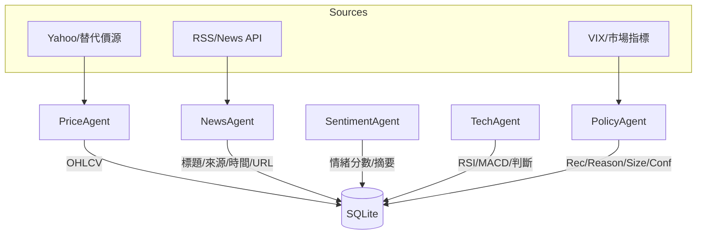
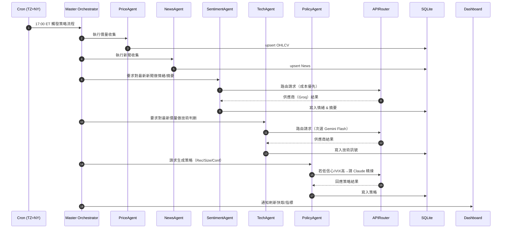

# 🧭 System Architecture — AI 專業投資團隊 (v2)

> 本文件說明：整體架構圖、分層設計、AI Agent 角色與分工、資料流、例行執行序列、迭代方式與治理、KPI 與里程碑。
> **注意**：本文件僅規劃，**不含任何程式碼**。

---

## 1) 整體架構圖（Context → Container）

```mermaid
flowchart LR
    subgraph User["👤 使用者 / 經理人"]
      U1[行動裝置]
      U2[桌機瀏覽器]
    end

    subgraph Dashboard["📊 Streamlit 儀表板"]
      V1[策略/情緒/技術視圖]
      V2[系統狀態 & 健康指標]
    end

    subgraph Core["🧠 AI 投資核心系統"]
      A1[Master Orchestrator]
      A2[Data Collector 層<br/>股價/新聞]
      A3[Analyst 層<br/>情緒/技術]
      A4[Strategist 層<br/>決策/倉位/信心]
      A5[APIRouter<br/>成本路由 + Failover]
    end

    subgraph Infra["🛠️ 基礎設施"]
      I1[(SQLite DB)]
      I2[Logs & Metrics]
      I3[Backups (rclone→Drive/GCS)]
      I4[Systemd + Cron (TZ=NY)]
      I5[Telegram/Email 告警]
    end

    U1 -- 查詢/手機查看 --> Dashboard
    U2 -- 審查/下載報告 --> Dashboard
    Dashboard -- 讀取資料 --> I1

    A1 --> A2 --> A3 --> A4
    A1 --> A5
    A2 -- 價/量/新聞 --> I1
    A3 -- 分析結果 --> I1
    A4 -- 策略 & KPI --> I1
    A1 -- 執行日誌 --> I2
    I2 -- 告警事件 --> I5

    I4 -- 觸發 --> A1
    I3 -. 每日/每週備份 .-> I1
```

---

## 2) 分層設計（Layered Architecture）

- **Presentation 層**：Streamlit 儀表板（行動優先），對外只讀；提供「最新策略、歷史曲線、系統健康燈號、成本儀表」。
- **Orchestration 層**：Master Orchestrator 負責依據 `config.yaml` 串聯 Collector → Analyst → Strategist，並寫入日誌/指標。
- **Analysis 層**：
  - **Data Collector**：抓取 SPY（後續可擴指標的 symbol）之價量與新聞（RSS/API）。
  - **Analyst**：
    - 新聞情緒與摘要（任務偏輕）：路由至 **Groq**。
    - 技術指標趨勢（RSI/MACD 等，任務偏中）：路由至 **Gemini Flash**。
  - **Strategist**：匯總產出 **Recommendation / Reasoning / Position Size / Confidence**；必要時觸發 **Claude** 精煉。
- **Routing 層**：APIRouter 依 **成本/延遲/可用性** 動態選擇供應商；支援 **Failover**、重試與降級。
- **Persistence 層**：SQLite（含 `strategies`、`news`、`prices`、`logs` 等），支援備份與壓縮存檔。
- **Ops 層**：Systemd + Cron（`TZ=America/New_York`）、健康檢查 `/health`、Telegram/Email 告警、成本與 KPI 追蹤。

---

## 3) AI Agent 角色與分工（R&R / RACI）

### 3.1 角色清單
- **Master Orchestrator**（責任：排程、管線管理、重試/退避、寫日誌）
- **Data Collector — PriceAgent**（責任：抓價量、去重、冪等寫入）
- **Data Collector — NewsAgent**（責任：抓新聞、正規化欄位、去重）
- **Analyst — SentimentAgent**（責任：對 News 做情緒分數與摘要；建議 Groq）
- **Analyst — TechAgent**（責任：對價量產出 RSI/MACD 趨勢；建議 Gemini Flash）
- **Strategist — PolicyAgent**（責任：合成策略、倉位與信心；低信心/高波動時請 Claude 佐證）
- **APIRouter**（責任：成本優先 + Failover，供 Agent 調用）

### 3.2 RACI 矩陣（摘要）
| 活動 | R | A | C | I |
|---|---|---|---|---|
| 排程與執行 | Master | Master | 全體 Agent | 儀表板使用者 |
| 價量收集 | PriceAgent | Master | APIRouter | Strategist |
| 新聞收集 | NewsAgent | Master | APIRouter | Strategist |
| 情緒分析 | SentimentAgent | Master | APIRouter | Strategist |
| 技術分析 | TechAgent | Master | APIRouter | Strategist |
| 策略生成 | PolicyAgent | Master | APIRouter | 儀表板使用者 |
| 成本/Failover | APIRouter | Master | — | 儀表板使用者 |
> R=Responsible, A=Accountable, C=Consulted, I=Informed

---

## 4) 資料流（Data Flow & Storage Map）



- **主鍵與索引**：`prices(symbol, date)`、`news(source, published_at, url_hash)`、`strategies(date, symbol)`；必要時增加索引以支援查詢效率。
- **冪等與去重**：以 `url_hash` / `(symbol,date)` 作為去重鍵；Collector 重跑不導致重複資料。

---

## 5) 每日例行執行（Sequence Diagram）



---

## 6) 迭代方式（MVP → 智能增強 → 部署優化）

- **迭代節奏**：按照 21 天計畫，每 7 天為一個里程碑（M1/M2/M3）。
- **迭代準則**：
  1. **資料先行**：先確保 Collector 與儲存完整、可溯源。
  2. **可復現**：所有分析結果（情緒/技術/策略）都能從 DB 或日誌復現。
  3. **成本守門**：APIRouter 記錄 Token/成本；每日/每週匯總 KPI。
  4. **風險防線**：Failover 與重試退避優先實作，確保不中斷。
  5. **UI 最小可用**：先有讀取/查詢能力，再精緻化互動。
- **變更流程（治理）**：
  - 設置 `docs/CHANGELOG.md` 與 Git Tag（`v0.1-m1`，`v0.2-m2`…）。
  - 大變更需更新：`docs/project_proposal.md`、`docs/system_architecture.md`、`docs/task_cards.md`。
  - 每次完成 3 個任務卡即更新 `docs/progress.md`（勾選 + Daily Log）。

---

## 7) KPI 與監控面板（運維指標）

- **可靠性**：可用性 ≥ 99%、Cron 準點率 ≥ 99%、Failover 成功率 ≥ 95%。
- **成本**：月成本 ≤ 2 美元；單日 Token 消耗門檻與告警閥值。
- **效能**：任務鏈路 P50 < 3s（LLM 任務除外）、全管線完成 < 5 分鐘。
- **策略品質**：7/30 日 Sharpe、MaxDD、命中率、平均盈虧比。
- **資料品質**：缺值率、重複率、來源覆蓋、延遲。

---

## 8) 未來擴充 Roadmap（選配）

- **多標的**：SPY → QQQ、IWM、台股 0050；引入權重化投組。  
- **替代資料**：Twitter / X 訊號、Google Trends、財報日曆。  
- **回測框架**：事件驅動 + 交易成本、滑點模型；策略版本化。  
- **實單接軌**：新增 `is_executed` 流程，接券商模擬或紙上交易。  
- **可觀測性**：Prometheus 指標 + Grafana（或 Streamlit 小部件）。

---

## 9) 附錄：主要資料表（邏輯層級）

| 表名 | 主要欄位 | 用途 |
|---|---|---|
| `prices` | symbol, date, ohlcv… | 儲存日線/更細快照 |
| `news` | id, title, source, url_hash, published_at | 市場新聞，去重與追溯 |
| `sentiments` | news_id, score, summary | 情緒與摘要 |
| `tech_signals` | date, symbol, rsi, macd, trend | 技術指標與判斷 |
| `strategies` | date, symbol, recommendation, reasoning, position_size, confidence, is_executed | 策略建議與執行狀態 |
| `logs` | ts, agent, level, message, meta | 系統運行日誌 |

---

> 本文件與 `project_proposal.md`、`task_cards.md`、`progress.md` 一起使用，對應 21 天計畫的 M1/M2/M3 節點與可交付成果。
